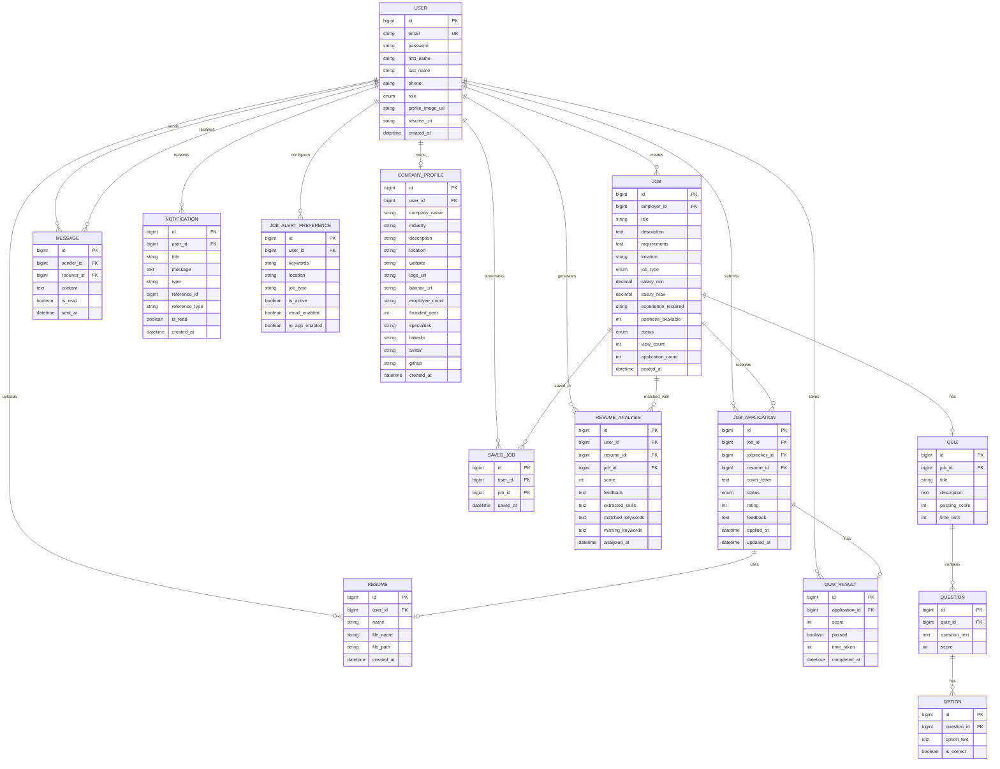
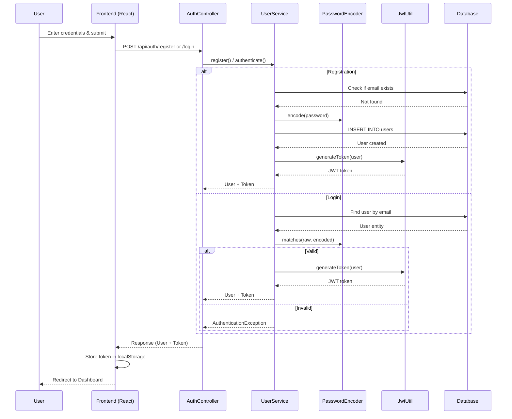
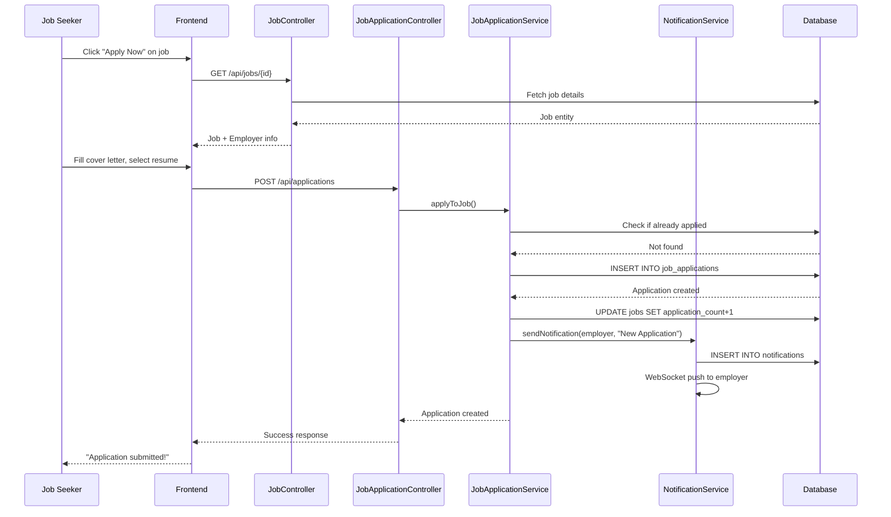
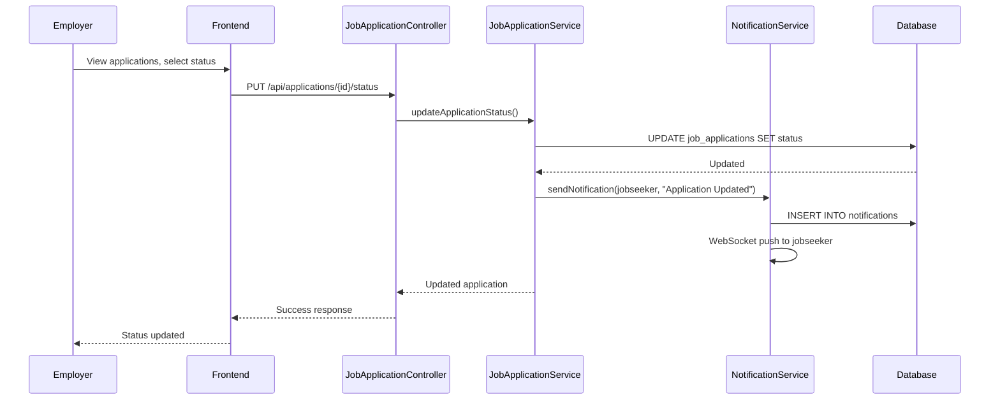
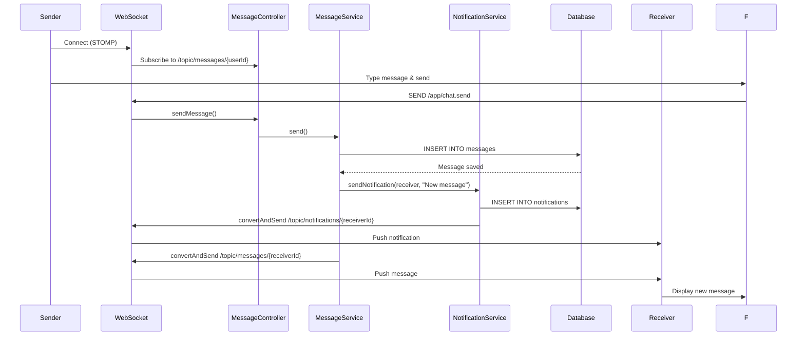
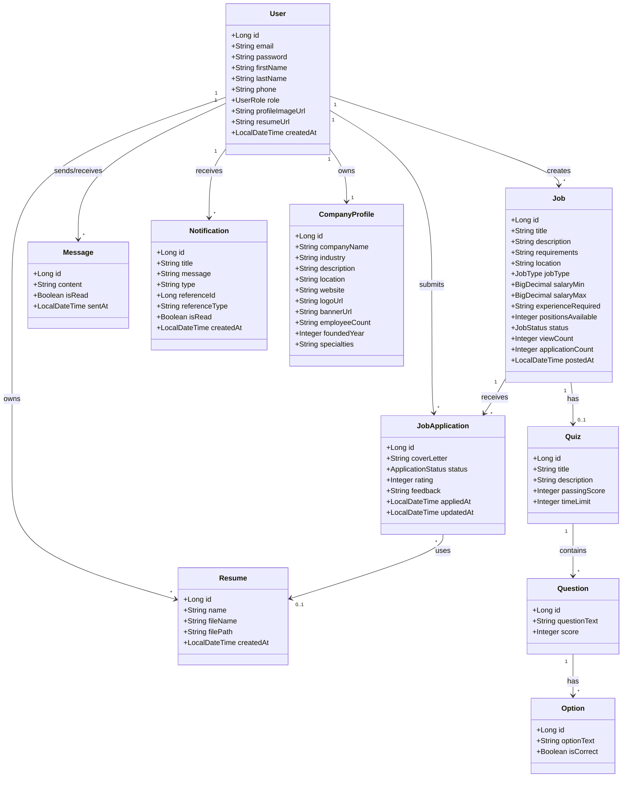

# Job Portal - Project Documentation

## 1. Introduction

The Job Portal is a full-stack web application that connects job seekers with employers. It provides a comprehensive platform for posting jobs, applying to positions, tracking applications, communicating in real-time, and managing the entire recruitment lifecycle. Built with Spring Boot (backend) and React (frontend), the system supports three user roles: Job Seeker, Employer, and Administrator.

---

## 2. System Architecture

```
┌─────────────────────────────────────────────────────────────────┐
│                        CLIENT LAYER                              │
│  ┌──────────┐ ┌──────────┐ ┌──────────┐ ┌──────────┐           │
│  │  React   │ │ Tailwind │ │ Zustand  │ │  Axios   │           │
│  │  SPA     │ │   CSS    │ │  State   │ │  HTTP    │           │
│  └──────────┘ └──────────┘ └──────────┘ └──────────┘           │
└──────────────────────────┬──────────────────────────────────────┘
                           │ HTTP / WebSocket (STOMP)
┌──────────────────────────▼──────────────────────────────────────┐
│                       API GATEWAY                                │
│  ┌──────────────────────────────────────────────────────────┐   │
│  │              Spring Boot REST API (Port 8080)             │   │
│  │  ┌─────────────┐ ┌─────────────┐ ┌─────────────────────┐ │   │
│  │  │ JWT Filter  │ │ CORS Config │ │ WebSocket Handler   │ │   │
│  │  └─────────────┘ └─────────────┘ └─────────────────────┘ │   │
│  └──────────────────────────────────────────────────────────┘   │
└──────────────────────────┬──────────────────────────────────────┘
                           │
┌──────────────────────────▼──────────────────────────────────────┐
│                     SERVICE LAYER                                │
│  ┌────────┐ ┌────────┐ ┌────────┐ ┌────────┐ ┌────────┐       │
│  │  User  │ │  Job   │ │  App   │ │ Message│ │ Resume │       │
│  │ Service│ │ Service│ │ Service│ │ Service│ │ Service│       │
│  └────────┘ └────────┘ └────────┘ └────────┘ └────────┘       │
│  ┌────────┐ ┌────────┐ ┌────────┐ ┌────────┐ ┌────────┐       │
│  │  Quiz  │ │ Admin  │ │ Email  │ │Notifica│ │Company │       │
│  │ Service│ │ Service│ │ Service│ │ Service│ │ Service│       │
│  └────────┘ └────────┘ └────────┘ └────────┘ └────────┘       │
└──────────────────────────┬──────────────────────────────────────┘
                           │ JPA / Hibernate
┌──────────────────────────▼──────────────────────────────────────┐
│                    DATA ACCESS LAYER                             │
│  ┌──────────────────────────────────────────────────────────┐   │
│  │              Spring Data JPA Repositories                 │   │
│  └──────────────────────────────────────────────────────────┘   │
└──────────────────────────┬──────────────────────────────────────┘
                           │ JDBC
┌──────────────────────────▼──────────────────────────────────────┐
│                     DATABASE                                     │
│  ┌──────────────────────────────────────────────────────────┐   │
│  │                    MySQL 8.0                              │   │
│  │              Database: job_portal                         │   │
│  └──────────────────────────────────────────────────────────┘   │
└─────────────────────────────────────────────────────────────────┘
```

---

## 3. Modules

| Module | Description |
|--------|-------------|
| Authentication | Registration, login, JWT tokens, role-based access control |
| Job Management | Create, edit, delete, search, filter job listings |
| Application Management | Apply to jobs, track status, employer review |
| Resume Management | Upload, ATS scoring, keyword matching, multiple resumes |
| Messaging | Real-time chat, unread tracking, conversation history |
| Quiz & Assessment | Skill quizzes, timed tests, automated scoring |
| Admin Management | User/job management, role changes, platform stats |
| Company Profile | Company branding, logo, banner, social links |
| Notifications | Real-time alerts via WebSocket, click-to-navigate |
| Job Alerts | User preferences, automatic matching, email notifications |
| Saved Jobs | Bookmark jobs for later |
| Analytics | Per-job metrics, employer dashboards, application funnels |

---

## 4. Entity Relationship Diagram (ERD)



---

## 5. Use Case Diagram

```mermaid
graph TB
    subgraph Actors
        JS[Job Seeker]
        EM[Employer]
        AD[Admin]
    end

    subgraph Job Seeker Use Cases
        JS --> JS1[Register/Login]
        JS --> JS2[Search & Filter Jobs]
        JS --> JS3[View Job Details]
        JS --> JS4[Apply to Jobs]
        JS --> JS5[Track Applications]
        JS --> JS6[Take Skill Quizzes]
        JS --> JS7[Upload & Manage Resumes]
        JS --> JS8[Save/Bookmark Jobs]
        JS --> JS9[Chat with Employers]
        JS --> JS10[Set Job Alerts]
        JS --> JS11[View Notifications]
    end

    subgraph Employer Use Cases
        EM --> EM1[Register/Login]
        EM --> EM2[Post & Manage Jobs]
        EM --> EM3[View Applications]
        EM --> EM4[Update Application Status]
        EM --> EM5[Create Skill Quizzes]
        EM --> EM6[Chat with Candidates]
        EM --> EM7[Manage Company Profile]
        EM --> EM8[View Job Analytics]
    end

    subgraph Admin Use Cases
        AD --> AD1[Manage Users]
        AD --> AD2[Manage Jobs]
        AD --> AD3[Change User Roles]
        AD --> AD4[View Platform Stats]
        AD --> AD5[Delete Users/Jobs]
    end
```



---

## 6. Sequence Diagrams

### 6.1 User Registration & Login Flow



### 6.2 Job Application Flow



### 6.3 Application Status Update Flow



### 6.4 Real-Time Messaging Flow



---

## 7. Class Diagram



---

## 8. Database Schema

### 8.1 Core Tables

| Table | Columns | Primary Key | Foreign Keys |
|-------|---------|-------------|--------------|
| **users** | id, email, password, first_name, last_name, phone, role, profile_image_url, resume_url, created_at, updated_at | id | - |
| **jobs** | id, employer_id, title, description, requirements, location, job_type, salary_min, salary_max, experience_required, positions_available, status, view_count, application_count, posted_at, updated_at | id | employer_id → users(id) |
| **job_applications** | id, job_id, jobseeker_id, resume_id, cover_letter, status, rating, feedback, applied_at, updated_at | id | job_id → jobs(id), jobseeker_id → users(id), resume_id → resumes(id) |
| **messages** | id, sender_id, receiver_id, content, is_read, sent_at | id | sender_id → users(id), receiver_id → users(id) |
| **resumes** | id, user_id, name, file_name, file_path, created_at | id | user_id → users(id) |
| **notifications** | id, user_id, title, message, type, reference_id, reference_type, is_read, created_at | id | user_id → users(id) |
| **quizzes** | id, job_id, title, description, passing_score, time_limit | id | job_id → jobs(id) |
| **questions** | id, quiz_id, question_text, score | id | quiz_id → quizzes(id) |
| **options** | id, question_id, option_text, is_correct | id | question_id → questions(id) |
| **company_profiles** | id, user_id, company_name, industry, description, location, website, logo_url, banner_url, employee_count, founded_year, specialties, linkedin, twitter, github, created_at, updated_at | id | user_id → users(id) |
| **saved_jobs** | id, user_id, job_id, saved_at | id | user_id → users(id), job_id → jobs(id) |
| **job_alert_preferences** | id, user_id, keywords, location, job_type, is_active, email_enabled, in_app_enabled | id | user_id → users(id) |
| **resume_analyses** | id, user_id, resume_id, job_id, score, feedback, extracted_skills, matched_keywords, missing_keywords, analyzed_at | id | user_id → users(id), resume_id → resumes(id), job_id → jobs(id) |
| **quiz_results** | id, application_id, score, passed, time_taken, completed_at | id | application_id → job_applications(id) |

---

## 9. API Documentation

### 9.1 Authentication

| Method | Endpoint | Auth | Description |
|--------|----------|------|-------------|
| POST | `/api/auth/register` | Public | Register new user |
| POST | `/api/auth/login` | Public | Login with email/password |
| PUT | `/api/users/{id}/password` | User | Change password |

### 9.2 Jobs

| Method | Endpoint | Auth | Description |
|--------|----------|------|-------------|
| GET | `/api/jobs` | Public | Search & filter jobs |
| GET | `/api/jobs/{id}` | Public | Get job details |
| POST | `/api/jobs` | Employer | Create job |
| PUT | `/api/jobs/{id}` | Employer | Update job |
| DELETE | `/api/jobs/{id}` | Employer/Admin | Delete job |
| GET | `/api/jobs/employer/{id}` | Public | Get employer's jobs |
| GET | `/api/jobs/{id}/analytics` | Employer | Job analytics |

### 9.3 Applications

| Method | Endpoint | Auth | Description |
|--------|----------|------|-------------|
| POST | `/api/applications` | Job Seeker | Apply to job |
| GET | `/api/applications/seeker/{id}` | Job Seeker | Get my applications |
| GET | `/api/applications/employer/{id}` | Employer | Get applications for jobs |
| PUT | `/api/applications/{id}/status` | Employer | Update status |
| DELETE | `/api/applications/{id}` | Employer/Admin | Delete application |

### 9.4 Messaging

| Method | Endpoint | Auth | Description |
|--------|----------|------|-------------|
| GET | `/api/messages/inbox/{userId}` | User | Get inbox |
| GET | `/api/messages/conversation/{userId}` | User | Get conversation |
| POST | `/api/messages/send` | User | Send message |
| GET | `/api/messages/unread-count/{userId}` | User | Unread count |

### 9.5 Resume

| Method | Endpoint | Auth | Description |
|--------|----------|------|-------------|
| POST | `/api/resume/upload` | User | Upload resume PDF |
| GET | `/api/resume/user/{userId}` | User | Get user's resumes |
| POST | `/api/resume/analyze/{resumeId}` | User | ATS analysis |
| POST | `/api/resume/match/{resumeId}/{jobId}` | User | Match score |
| DELETE | `/api/resume/delete/{resumeId}` | User | Delete resume |

### 9.6 Admin

| Method | Endpoint | Auth | Description |
|--------|----------|------|-------------|
| GET | `/api/admin/users` | Admin | List all users |
| GET | `/api/admin/jobs` | Admin | List all jobs |
| GET | `/api/admin/stats` | Admin | Platform stats |
| PUT | `/api/admin/users/{id}/role` | Admin | Change user role |
| DELETE | `/api/admin/users/{id}` | Admin | Delete user |
| DELETE | `/api/admin/jobs/{id}` | Admin | Delete job |

---

## 10. Technology Stack

### Backend
- **Java 25** - Programming language
- **Spring Boot 4.0.4** - Application framework
- **Spring Security** - Authentication & authorization
- **Spring Data JPA** - Data access layer
- **Hibernate 7.2** - ORM framework
- **MySQL 8.0** - Relational database
- **WebSocket (STOMP)** - Real-time communication
- **JavaMailSender** - Email notifications
- **Lombok** - Boilerplate reduction

### Frontend
- **React 19** - UI library
- **Vite 7** - Build tool
- **Tailwind CSS** - Styling framework
- **Zustand** - State management
- **Axios** - HTTP client
- **Lucide React** - Icon library
- **Recharts** - Charting library

### DevOps
- **Maven** - Build automation
- **Git** - Version control
- **GitHub** - Repository hosting

---

## 11. Security Features

| Feature | Implementation |
|---------|---------------|
| Password Encryption | BCrypt hashing via Spring Security PasswordEncoder |
| JWT Authentication | Stateless token-based auth with 24-hour expiration |
| Role-Based Access | @PreAuthorize annotations on endpoints |
| CORS Configuration | Whitelisted origins for frontend |
| Input Validation | @Valid annotations on request bodies |
| SQL Injection Prevention | JPA parameterized queries |
| XSS Prevention | React auto-escapes output |
| File Upload Validation | PDF-only restriction, size limits |

---

## 12. Future Enhancements

- **OAuth2 Login** - Google, GitHub, LinkedIn sign-in
- **AI Resume Parsing** - LLM-based skill extraction
- **Video Interviews** - Integrated video calling
- **Push Notifications** - Browser & mobile push
- **Mobile App** - React Native companion app
- **Advanced Analytics** - Machine learning job matching
- **Multi-language Support** - Internationalization (i18n)
- **Payment Integration** - Premium job postings
- **Candidate Scoring** - AI-based candidate ranking
- **Interview Scheduling** - Calendar integration
